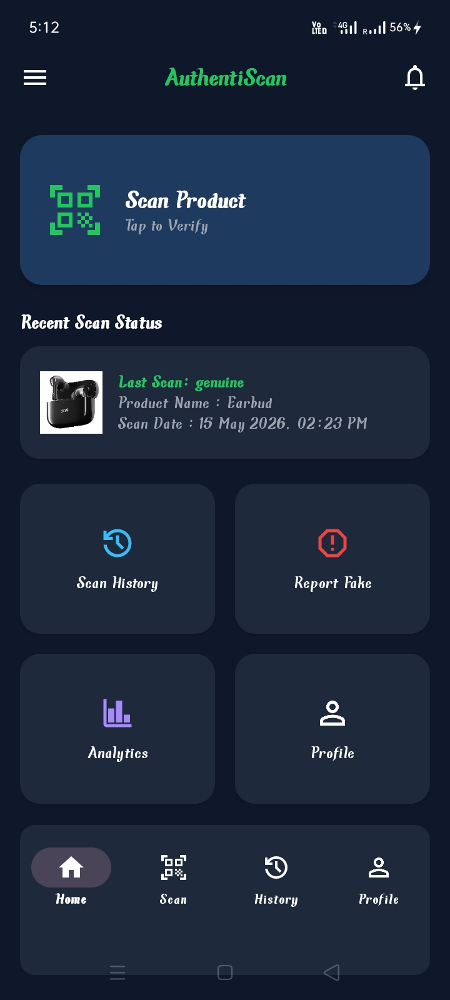

# 🛡️ AuthentiScan - QR Based Product Authenticity Scanner (Consumer Side)

<div align="center">


### Detect Counterfeit Products Using QR Code & Scratch Code Verification

A smart Android application that helps consumers verify product authenticity, detect duplicate products, and report suspicious items using QR code technology and Firebase-powered validation.

</div>

---

## 🌐 Live Demo

**Android Application (APK):**
Download the latest APK from the this repository Releases section.

**Manufacturer Portal**  
👉 https://authentiscan-3478a.web.app/

---

## 🔗 Related Repository

**This project is part of the AuthentiScan ecosystem.**
 - 🏭 Manufacturer Portal (React)
 - 📱 Consumer Android Application (Kotlin)
 - ☁️ Firebase Backend (Authentication, Firestore, Storage)

Together they provide a complete QR-based product authenticity verification system.

| Repository | Link |
|------------|-------------|
| **Manufacturer Portal** | https://github.com/Ritesh000001/product-authenticity-web |
| **Android Application** | https://github.com/Ritesh000001/product-authenticity-android |

---

## 📌 Problem Statement

Counterfeit and duplicate products have become a major challenge across industries such as electronics, pharmaceuticals, cosmetics, and consumer goods.

Consumers often have no reliable method to verify whether a purchased product is genuine or fake.

This project provides a secure and scalable solution that allows users to:

- Verify products using QR codes
- Authenticate products using scratch verification codes
- Detect suspicious repeated scans
- Report counterfeit products
- Maintain scan and report history
- Generate analytics for better product tracking

---

## 🚀 Overview

**AuthentiScan** is an Android application developed using **Kotlin**, **Firebase Authentication**, **Cloud Firestore**, and **Firebase Storage**.

Each product is assigned:

- Unique Product ID
- QR Code
- Scratch Verification Code

Users can scan the QR code to verify product authenticity.

### Verification Logic

✅ First Scan + Correct Scratch Code

→ Genuine Product

⚠ Multiple Scans After Verification

→ Already Scanned Product

🚨 Multiple Scans Without Verification

→ Suspicious Product

❌ Invalid QR / Wrong Scratch Code

→ Fake Product

---

## ✨ Features

### 🔐 Authentication

- User Registration
- Secure Login
- Firebase Authentication

---

### 📷 QR Code Scanning

- Real-time QR Scanner
- Gallery Image QR Detection
- Instant Product Lookup

---

### 🎟 Scratch Code Verification

- Product-specific scratch code validation
- First-time product authentication

---

### 🛡 Product Verification

- Genuine Product Detection
- Fake Product Detection
- Suspicious Product Detection
- Duplicate Scan Detection

---

### 📜 Scan History

- Complete scan history tracking
- Product image support
- Scan timestamps
- Scan location storage

---

### 🚨 Report Fake Products

- Report suspicious products
- Store reporting reason
- Maintain report history

---

### 📊 Analytics Dashboard

- Total Scans
- Genuine Products
- Fake Products
- Suspicious Products
- Visual Analytics Charts

---

### 🔔 Notifications

- Product alerts
- Scan-related updates

---

### 🖼 Product Image Management

- Firebase Storage Integration
- Product Image Display
- Full Screen Image Preview

---

## 🏗 App Architecture

<div align="center">

```text
+--------------------+
|       User         |
+---------+----------+
          |
          v
+--------------------+
| Android App        |
| (Kotlin)           |
+---------+----------+
          |
          v
+--------------------+
| QR Code Scanner    |
| (ZXing Library)    |
+---------+----------+
          |
          v
+--------------------+
| Firebase Firestore |
+---------+----------+
          |
    +-----+-----+
    |           |
    v           v
Products     Scan History
Collection   Collection
    |           |
    v           v
Verification  Analytics
    |
    v
+--------------------+
| Result Engine      |
+--------------------+
      |
      +------ Genuine
      |
      +------ Fake
      |
      +------ Suspicious
      |
      +------ Already Scanned
```
</div>

---

## 🔄 End-to-End System Workflow

<div align="center">

```text
Manufacturer
      |
      v
Add Product
(Web Portal)
      |
      v
Generate QR Code + Scratch Code
      |
      v
Store Product Data in Firebase
      |
      v
Consumer Scans QR
(Android App)
     |
     v
Fetch Product from Firestore
     |
     |
Product Found?
     |
 +---+---+
 |       |
No      Yes
 |        |
Fake    First Scan?
          |
      +---+---+
      |       |
     Yes      No
      |        |
Enter Scratch  Check Verification Status
Code           |
      |         |
Correct?        |
      |         |
+-----+----+    |
|          |    |
Yes       No    |
|          |    |
Genuine   Fake  |
                |
       +--------+--------+
       |                 |
 Verified         Not Verified
       |                 |
Already Scanned   Suspicious
```
</div>

---

## ⚙️ Tech Stack

| Component | Technology |
|-----------|-----------|
| **Frontend** | Kotlin , Android XML |
| **Backend** | Firebase Authentication , Cloud Firestore , Firebase Storage |
| **Libraries** | ZXing Barcode Scanner , Glide Image Loader , RecyclerView , Material Design Components |
| **Database** | Cloud Firestore |
| **Authentication** | Firebase Auth |

---

## 📸 Screenshots

**Splash Screen**


---

**Login**


---

**Dashboard**



---

**QR Scanner**


---

**Product Verification Detail**


---

**Scan History**


---

**Report History**


---

**Analytics**


---

**Profile**


---

## 📱 APK
APK available in GitHub Releases.

---

## 🛠️ Setup Instructions

1️⃣ **Clone Repository**

```bash
git clone https://github.com/Ritesh000001/product-authenticity-android
```

---

2️⃣ **Open Project**

Open project in:

```text
Android Studio Hedgehog or above
```

---

3️⃣ **Connect Firebase**

Create Firebase Project

Enable:

- Authentication
- Cloud Firestore
- Storage

Download:

```text
google-services.json
```

Place it inside:

```text
app/
```

---

4️⃣ **Sync Gradle**

```bash
Sync Project with Gradle Files
```

---

5️⃣ **Run Application**

Connect device/emulator and click:

```text
Run ▶
```

---

## 📂 Firestore Collections

**products**

```text
- productName
- manufacturerId
- scratchCode
- scanCount
- scratchVerified
- manufacturingDate
- expiryDate
- productImageUrl
```

---

**scans**

```text
- productId
- status
- scanTime
- location
- userId
- productImageUrl
```

---

**reports**

```text
- productId
- productName
- reason
- status
- reportTime
- userId
- productImageUrl
```

**users**

```text
- name
- email
- role
- createdAt
```

---

## 🔗 Relationship With Web Portal (Manufacturer Side)

This portal is only one part of the complete AuthentiScan ecosystem. 

**1. Web Portal**

Responsible for:

- Product Registration
- QR Code Generation
- Scratch Code Generation
- Product Data Management

**2. Android Application**

Responsible for:

- QR Scanning
- Product Verification
- Scan Tracking
- Analytics
- Fake Product Reporting

This Android Application can only verify the products which are registered through the web portal.

---

## 🔮 Future Enhancements

1. 🌍 **Live GPS Integration**

   Replace static coordinates with real-time user location.

2. 🤖 **AI-Based Counterfeit Detection**

   Use machine learning models to detect fake products from images.

3. 📈 **Advanced Analytics**

   Interactive charts and user dashboards.

4. 🔔 **Push Notifications**

   Real-time alerts for suspicious scan activity.

5. ☁  **Multi-Stage Verfication**

   Support verification at multiple levels (manufacturers -> whole seller -> consumer )

---

## 🎯 Project Outcomes

✔ Improved product verification process

✔ Reduced counterfeit product risk

✔ Enhanced consumer trust

✔ Real-time product authentication

✔ Secure scan tracking system

✔ Centralized reporting mechanism

---

## 📜 License

This project is developed for educational and academic purposes.

You may use, modify, and extend the project with proper attribution.

---

## ⚠️ Disclaimer

This project is intended for educational, research, and demonstration purposes.

This project is a prototype demonstration of a centralized product authentication ecosystem.

The Android application can only verify products that have been registered through the Manufacturer Web Portal and stored in Firebase Firestore.

The verification results depend on the accuracy of the product data stored in Firebase Firestore. 

The developers are not responsible for any misuse, incorrect product information, or commercial deployment without appropriate security and compliance measures.

---

## 👨‍💻 Developer

### Ritesh Singh Kushwaha

📧 Email: riteshkushwaha0001@gmail.com.com

🔗 LinkedIn: https://www.linkedin.com/in/ritesh-singh-kushwaha/

🔗 GitHub: https://github.com/Ritesh000001

---

##  💬 Feedback & Suggestions

Found a bug? Have a suggestion? We'd love to hear from you!

- 🐛 [Report Issues](https://github.com/Ritesh000001/SecureMe/issues)
- 💡 [Request Features](https://github.com/Ritesh000001/SecureMe/issues/new)
- ⭐ [Star this Repository](https://github.com/Ritesh000001/SecureMe)

---

## ⭐ Support

If you found this project useful:

- Star the repository ⭐
- Fork the project 🍴
- Share feedback 💡

---

<div align="center">

🛡 AuthentiScan Ecosystem

Manufacturer Portal + Android Application = Complete Product Authentication System

Made with ❤️ by Ritesh Singh Kushwaha

</div>
